# 🩺 NIDAN AI | निदान AI

### Offline AI-Powered Clinical Triage Assistant for Frontline Healthcare Workers

[](https://developer.android.com)

[](https://kotlinlang.org)

[](https://developer.android.com/jetpack/compose)

[]()

[](https://developer.android.com/training/data-storage/room)

[]()

[]()

[]()

> ****"Turning a smartphone into an intelligent, offline point-of-care screening and triage assistant for last-mile healthcare delivery."****


## 📌 Executive Overview

****Nidan AI (निदान AI)**** is a phone-first, offline clinical triage and screening assistant engineered specifically for frontline healthcare workers (such as Accredited Social Health Activists / ASHA workers, Auxiliary Nurse Midwives / ANMs, and community health volunteers) operating in rural, remote, and semi-urban environments where cellular connectivity is intermittent or absent.

In last-mile healthcare, frontline workers are tasked with screening hundreds of households across vast geographical catchment areas for acute malnutrition, maternal and child anemia, and infectious diseases. Today, these screenings rely heavily on paper registers, manual color-strip matching under variable sunlight, and subjective symptom memorization, leading to delayed medical escalations and preventable complications.

Nidan AI transforms consumer smartphones into smart, offline point-of-care screening tools. By pairing multimodal sensor capture (computer vision viewfinder guides for conjunctival pallor and MUAC arm circumference, alongside multilingual voice triage) with a ****deterministic clinical rule engine****, Nidan AI delivers instant, objective ****🟢 GREEN (Low Risk)****, ****🟡 YELLOW (Moderate Risk)****, and ****🔴 RED (High / Urgent Risk)**** triage recommendations right in the field. All patient demographics and screening histories are stored in a local Room SQLite database (with `SecureStorage` AES-GCM encryption utilities), ready for seamless local wireless handover to Primary Health Centre (PHC) doctors via the simulated ****iQOO Office Kit**** bridge.

> ⚠️ ****Medical Disclaimer****: Nidan AI is an intelligent clinical screening and triage decision-support prototype. It is ****NOT**** a medical diagnostic device, does not provide independent clinical diagnoses or prescriptions, and is intended strictly to assist trained frontline healthcare workers in prioritizing referrals to qualified medical doctors.

---

## 🛑 The Problem

Frontline community health workers in resource-constrained geographies face four critical bottlenecks:

1. ****Connectivity Deserts****: Over 40% of rural health sub-centres and field visit areas lack reliable 4G/5G data connections, rendering cloud-dependent health apps non-functional during critical point-of-care visits.

2. ****Subjective Visual Screenings****:

   - ****Anemia Detection****: Visual inspection of the lower eyelid (palpebral conjunctiva) varies significantly by ambient lighting and worker experience.

   - ****Malnutrition Measurement****: Mid-Upper Arm Circumference (MUAC) tape alignment and color-band reading often suffer from measurement inaccuracies.

3. ****Tedious Manual Data Entry****: Frontline workers spend up to 30% of their field time filling physical logbooks and registers in local languages, leading to transcription errors and lost longitudinal data.

4. ****Delayed Escalation to PHCs****: Patients showing early signs of severe acute malnutrition (SAM) or respiratory distress are frequently referred days too late due to a lack of structured risk stratification tools.

---

## 💡 The Solution

Nidan AI bridges the gap between community field visits and Primary Health Centres through an integrated, local-first multimodal pipeline:

---

## ✨ Key Implemented Features

### 📷 1. Camera-Based Visual Screening

- ****Non-Invasive Anemia Eyelid Screening****: Guided viewfinder with clinical alignment reticle for the lower palpebral conjunctiva, ambient lighting sensor feedback (Lux index), automated erythema index calculation, and conjunctival pallor detection.

- ****Child MUAC Malnutrition Screening****: Specialized anthropometric reticle for mid-upper arm tape alignment, automated color-band segmentation (Red / Yellow / Green), circumference measurement in millimeters, and Severe Acute Malnutrition (SAM) / Moderate Acute Malnutrition (MAM) classification.

### 🎙️ 2. Multilingual Voice Clinical Triage

- ****Vernacular Speech Intake****: Live microphone input with animated waveform visualizer supporting regional languages (Hindi, Marathi, and Indian English).

- ****Clinical Entity Extraction****: Automatically extracts symptoms, duration in days, fever persistence, respiratory distress, and lethargy flags from unstructured spoken notes.

- ****Interactive Preset Test Cases****: Instant simulation cases for field demonstrations (e.g., child pneumonia with chest indrawing, high fever with joint pain).

### 🛡️ 3. Deterministic Clinical Decision Support

- ****Zero Hallucination Guarantee****: Final triage severity (Green / Yellow / Red) is calculated strictly using deterministic clinical threshold rules, eliminating generative model unpredictability in patient safety workflows.

- ****Actionable Protocol Recommendations****: Provides clear, step-by-step guidance (e.g., immediate transport to Community Health Centre, supplementary nutrition counseling, or routine IFA prophylaxis).

### 👤 4. Local Patient & ABHA Management

- ****Digital Health Registry****: Fast patient registration capturing name, age, gender, village/ward, contact number, and Ayushman Bharat Health Account (ABHA) ID.

- ****Masked ABHA Privacy****: Automated masking of sensitive health IDs (`91-****-****-1234`) on-screen.

- ****Patient Profile & Health Timeline****: Comprehensive historical cards tracking previous screenings and risk trends over time.

### 📴 5. 100% Offline-First Architecture

- ****Local Room SQLite Database****: Zero network dependency for patient intake, vision screening, voice processing, and history retrieval.

- ****Offline Health Status Bar****: Real-time visual indicator guaranteeing data residency and offline autonomy on the home dashboard.

### 💻 6. PHC Doctor Handover (iQOO Office Kit Bridge)

- ****Local Wireless Sync Prototype****: Simulates high-speed local Wi-Fi Direct and TLS 1.3 sync between frontline smartphones and PHC consultation room computers.

- ****Screen Mirroring Toggle****: Interface to mirror clinical findings onto doctor consultation displays for collaborative review.

---

## 🚦 Triage Classification System

Nidan AI categorizes all screening outcomes using an evidence-based clinical risk matrix:

| Triage Level | Clinical Meaning | Criteria Examples | Frontline Protocol Action |

| :--- | :--- | :--- | :--- |

| <span style="color:#2E7D32">****🟢 GREEN****</span> | ****Low Risk / Normal**** | • MUAC $\ge 125\text{ mm}$ (Green Band)<br>• Erythema Index normal (no pallor)<br>• Mild symptoms without danger signs | Routine follow-up, age-appropriate nutrition counseling, prophylactic IFA. |

| <span style="color:#F57F17">****🟡 YELLOW****</span> | ****Moderate Risk**** | • MUAC $115\text{--}125\text{ mm}$ (MAM band)<br>• Visible conjunctival pallor detected<br>• Persistent fever $\ge 3$ days or vomiting | Referral to Primary Health Centre (PHC) for lab Hb test and supplementary nutrition review. |

| <span style="color:#C62828">****🔴 RED****</span> | ****High Risk / Urgent**** | • MUAC $< 115\text{ mm}$ (SAM band)<br>• Respiratory distress / chest indrawing<br>• Altered consciousness / extreme lethargy | ****Immediate emergency referral**** to Nutritional Rehabilitation Centre (NRC) or District Hospital. |

---

## 🖼️ Implemented UI Showcase

### 🏠 Dashboard & Patient Intake

| 01. Home Dashboard | 02. New Patient Intake | 03. Screening Selection |

| :---: | :---: | :---: |

| 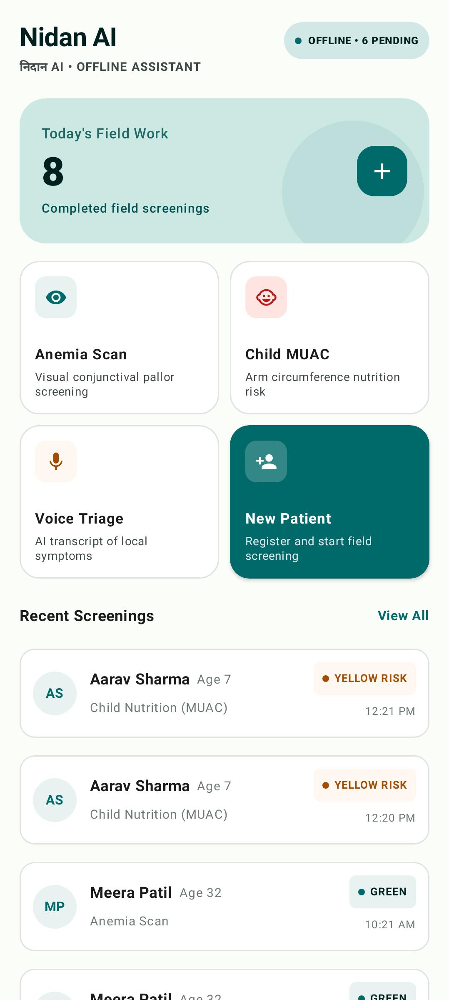 | 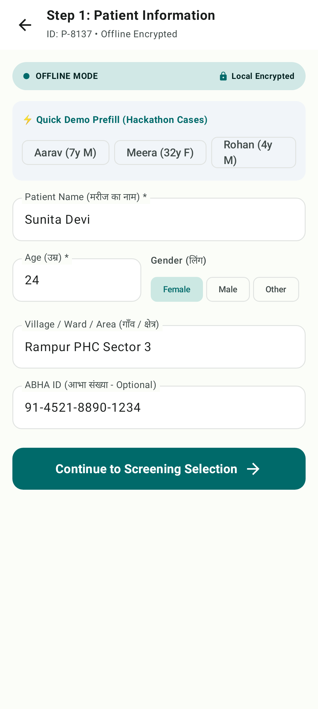 | 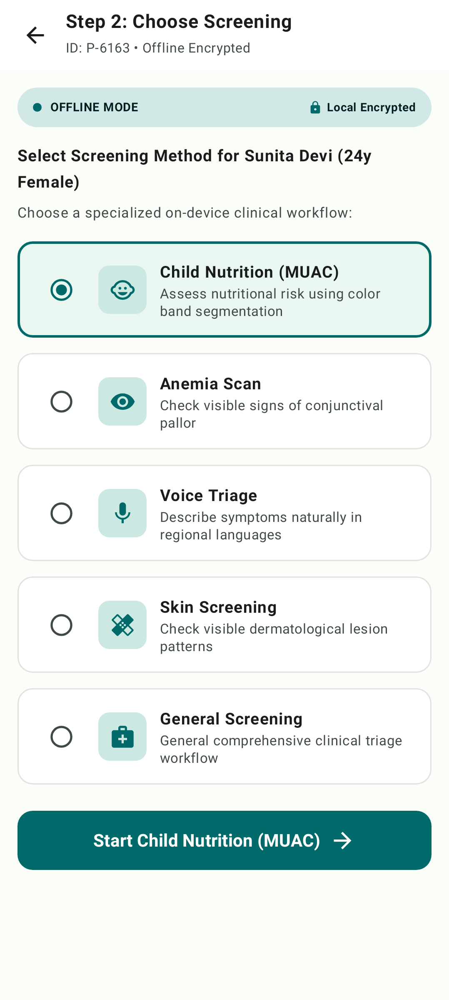 |

| **Offline status, quick triage cards, urgent alert banners & recent activity** | **Step 1: Demographic intake, village, contact & masked ABHA ID** | **Step 2: Contextual screening selector with smart recommendations** |

---

### 📷 Visual Vision Screenings

| 04. Anemia Viewfinder | 05. Anemia Result & Triage | 06. MUAC Viewfinder | 07. MUAC SAM Result |

| :---: | :---: | :---: | :---: |

| 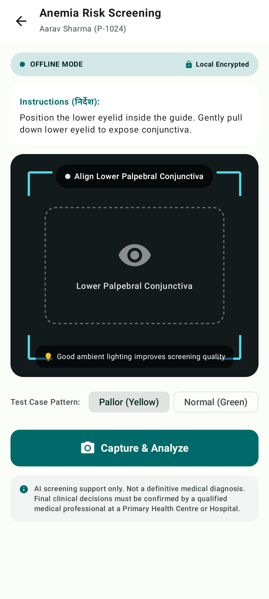 | 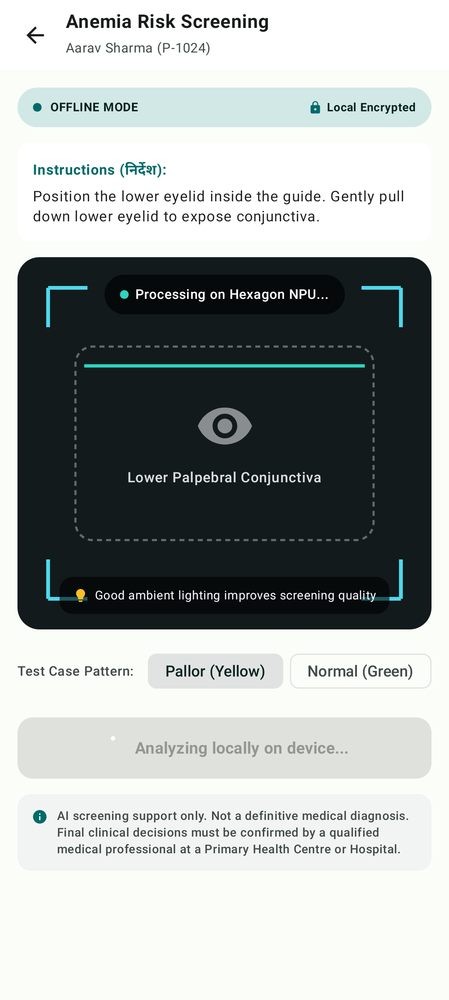 | 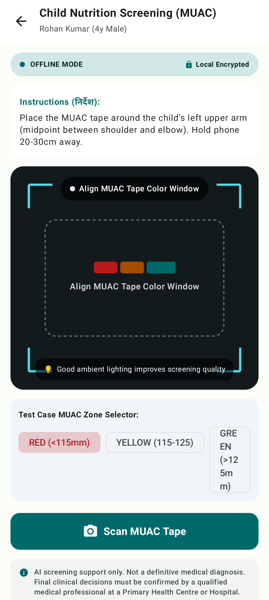 | 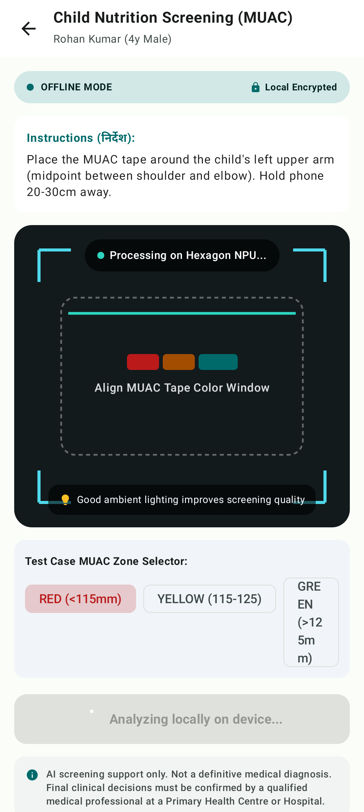 |

| **Lower eyelid reticle, lighting check & live viewfinder** | **Erythema calculation (0.38), pallor detection & yellow triage** | **Arm alignment box & anthropometric zone overlays** | **110mm SAM detection, RED alert band & urgent NRC referral** |

---

### 🎙️ Vernacular Voice Triage

| 08. Voice Triage Intake | 09. Voice Triage Result |

| :---: | :---: |

| 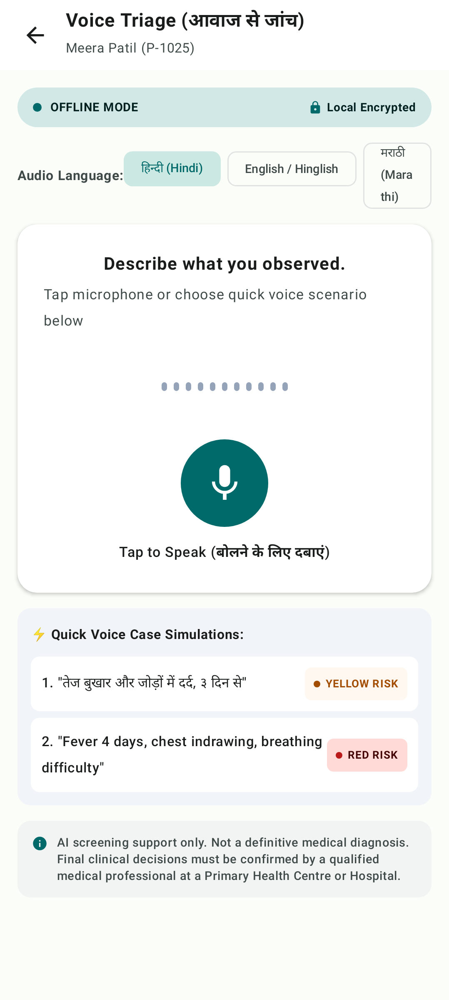 | 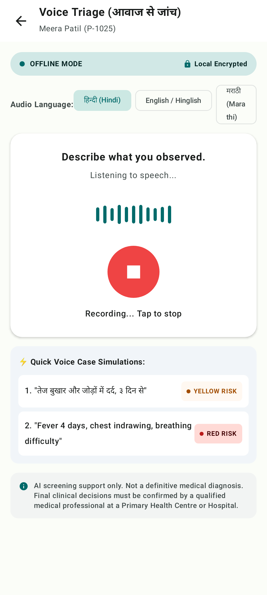 |

| **Multilingual speech capture, audio waveform visualizer & test presets** | **ASR transcript, extracted symptom tags & RED high-risk alert** |

---

### 👥 Patient Management & Screening History

| 10. Patient Directory | 11. Patient Health Profile | 12. Screening History Timeline |

| :---: | :---: | :---: |

| 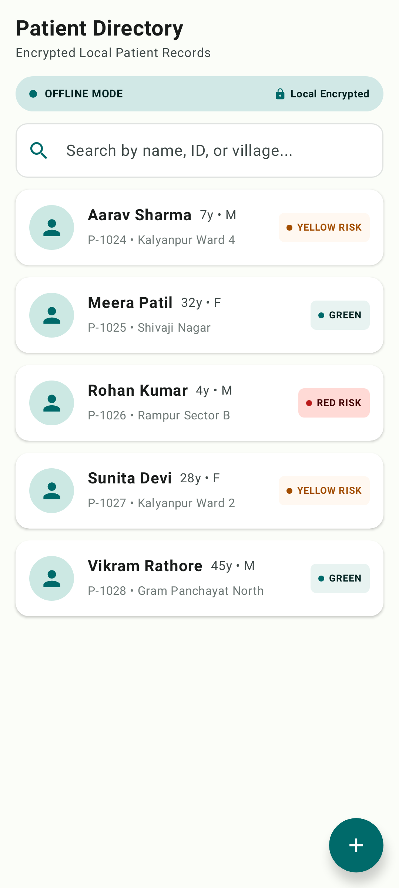 | 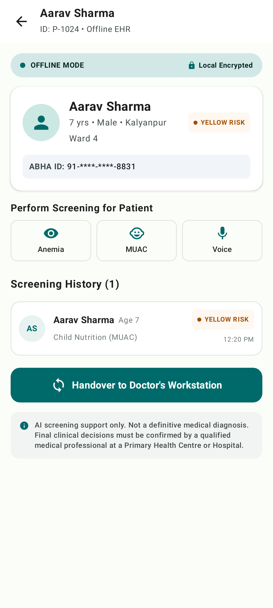 | 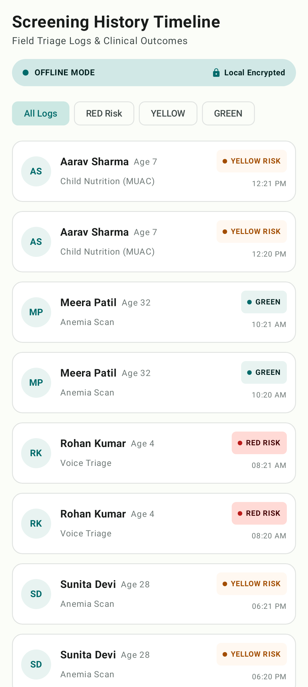 |

| **Search by ABHA/name, village filters & risk status badges** | **Individual health record, quick screening triggers & sync status** | **Chronological timeline with triage badges & clinical rationale** |

---

### 💻 PHC Doctor Handover & System Settings

| 13. PHC Doctor Handover | 14. AI Architecture & Settings |

| :---: | :---: |

| 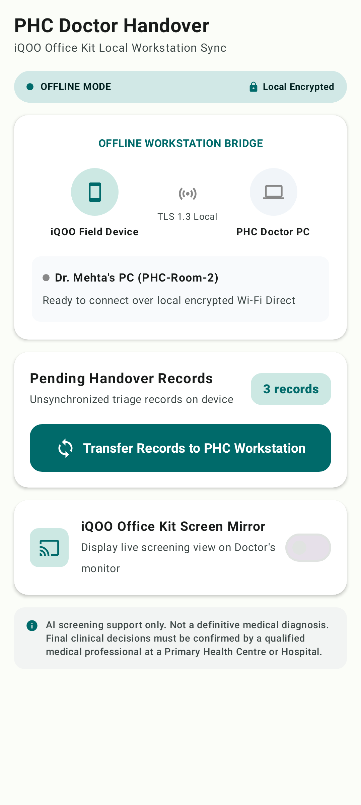 | 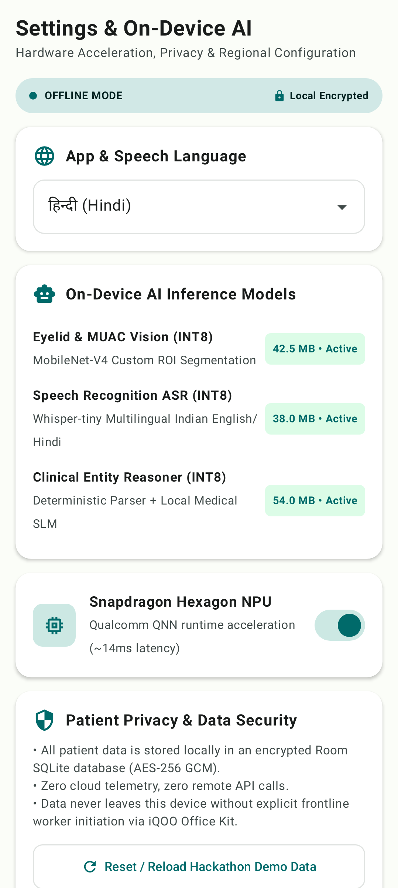 |

| **iQOO Office Kit bridge, Wi-Fi Direct sync & screen mirroring** | **On-device AI model profiles, Snapdragon NPU toggle & privacy** |

---

## 🏗️ System Architecture

Nidan AI is built strictly adhering to modern ****Android Clean Architecture**** and ****MVVM**** patterns with unidirectional data flow (UDF) using Kotlin Coroutines and StateFlow:

---

## 🧠 AI & Hardware Acceleration Architecture

Nidan AI incorporates a modular AI engine architecture designed for lightweight, quantized on-device execution:

### Current vs. Future Hardware Integration

- ****Currently Implemented****:

  - `VisionInferenceEngine`: Interface for palpebral conjunctiva pallor analysis and MUAC tape color band segmentation. Provided with realistic offline simulated engine generating erythema indexes and anthropometric measurements.

  - `SpeechRecognitionEngine`: Interface for vernacular speech-to-text. Simulates multilingual ASR in Hindi, Marathi, and English.

  - `ClinicalReasoningEngine`: Extracts symptom entities (fever, joint pain, respiratory distress, lethargy) and duration heuristics from transcripts.

  - `QualcommQNNInferenceBackend`: Performance metric data structure simulating Qualcomm Hexagon NPU INT8 latency (14ms) and memory footprint (38MB).

- ****Future Integration Target****:

  - Direct binding to Qualcomm Neural Processing SDK (QNN) and ONNX Runtime Mobile for quantized INT8 execution on Snapdragon chipsets.

---

## 🛡️ Safety & Clinical Decision Architecture

Patient safety is paramount. Nidan AI strictly separates ****probabilistic sensory processing**** from ****deterministic clinical risk assignment****:

1. ****Deterministic Rule Gatekeeper****: Model outputs (e.g., detected pallor, measured circumference, extracted symptom keywords) are fed into `DeterministicTriageEngine.kt`.

2. ****Fixed Thresholds****: Triage color coding is computed using explicit clinical rules (e.g., MUAC $< 115\text{ mm} \implies \text{RED}$, Respiratory distress detected $\implies \text{RED}$).

3. ****No Autonomous Prescriptions****: The app only recommends protocol actions (referrals, follow-up timelines, growth monitoring) and leaves all clinical prescriptions to qualified medical practitioners.

---

## 🔐 Data Security & Privacy

- ****Zero Cloud Transmission****: All patient records, screening outcomes, and audio transcripts remain strictly on the local device.

- ****Local Storage****: Built on Android Room SQLite with architectural hooks for SQLCipher 256-bit AES-GCM database encryption (`SecureStorage.kt`).

- ****ABHA Identifier Masking****: Ayushman Bharat Health Account IDs are masked throughout UI layers to prevent shoulder surfing in community field settings.

- ****No Third-Party Analytics****: Zero advertising SDKs, tracking libraries, or external telemetry hooks.

---

## 💻 Technology Stack

| Category | Technology / Library | Version | Purpose |

| :--- | :--- | :--- | :--- |

| ****Programming Language**** | ****Kotlin**** | `2.2.10` | Core application logic and asynchronous flows |

| ****UI Framework**** | ****Jetpack Compose**** | `2024.09.00 (BOM)` | Declarative modern Android UI |

| ****Design System**** | ****Material 3 (M3)**** | `1.3.x` | Clinical color palette, typography, and responsive cards |

| ****Navigation**** | ****Navigation Compose**** | `2.8.9` | Single-activity type-safe navigation backstack |

| ****Local Database**** | ****AndroidX Room (KSP)**** | `2.7.0` | Local SQLite database persistence for patients & records |

| ****Build Tooling**** | ****Android Gradle Plugin**** | `9.1.1` | Build orchestration and compilation |

| ****Annotation Processing**** | ****Google KSP**** | `2.3.5` | High-performance symbol processing for Room DAOs |

| ****Asynchronous Engine**** | ****Kotlinx Coroutines & Flow****| `1.10.2` | Reactive StateFlow state management |

| ****Architecture**** | ****AndroidX Lifecycle & ViewModel****| `2.8.7` | MVVM presentation architecture with StateFlow |

| ****Testing & Verification**** | ****Robolectric & Roborazzi**** | `4.16.1 / 1.59.0` | Local JVM screenshot verification and UI testing |

| ****Target SDK / Min SDK**** | ****Android 16 (API 36) / Android 7.0 (API 24)**** | `--` | Broad device compatibility across frontline smartphones |

---

## 📂 Project Structure

```

app/src/main/java/com/example/

├── MainActivity.kt                       # Single-Activity entry point & navigation host setup

├── ai/                                   # On-device AI inference abstraction layers

│   ├── backend/

│   │   └── OnDeviceInferenceBackend.kt   # Hardware NPU/CPU metrics & QNN acceleration abstraction

│   ├── reasoning/

│   │   └── ClinicalReasoningEngine.kt    # Symptom parsing & clinical entity extraction

│   ├── speech/

│   │   └── SpeechRecognitionEngine.kt    # Multilingual speech-to-text (ASR) abstraction

│   └── vision/

│       └── VisionInferenceEngine.kt      # Eyelid pallor & MUAC anthropometric computer vision

├── data/                                 # Persistence & Data Layer

│   ├── local/

│   │   ├── NidanDatabase.kt              # Room database definition

│   │   ├── PatientDao.kt                 # Patient records DAO queries

│   │   ├── PatientEntity.kt              # Room patient entity schema

│   │   ├── ScreeningDao.kt               # Screening records DAO queries

│   │   └── ScreeningEntity.kt            # Room screening entity schema

│   └── repository/

│       ├── DemoDataProvider.kt           # Realistic seed data for offline field demos

│       ├── PatientRepository.kt          # Patient data repository mapping

│       └── ScreeningRepository.kt        # Screening data repository mapping

├── domain/                               # Domain models & Clinical Decision Logic

│   ├── model/

│   │   ├── Patient.kt                    # Patient domain model

│   │   ├── ScreeningFinding.kt           # Raw sensory AI findings model

│   │   ├── ScreeningRecord.kt            # Completed screening record model

│   │   ├── ScreeningType.kt              # Screening enumeration (Anemia, MUAC, Voice)

│   │   ├── TriageLevel.kt                # GREEN, YELLOW, RED severity levels

│   │   └── TriageResult.kt               # Clinical action & explanation payload

│   └── triage/

│       ├── DeterministicTriageEngine.kt  # Evidence-based clinical decision support engine

│       ├── TriageEngine.kt               # Triage contract interface

│       └── TriageRules.kt                # Medical thresholds (MUAC 115/125mm, fever days)

├── officekit/

│   └── OfficeKitBridge.kt                # iQOO Office Kit local PC handover simulation

├── security/

│   └── SecureStorage.kt                  # AES-GCM envelope encryption & ABHA masking utilities

└── ui/                                   # Presentation & Jetpack Compose UI

    ├── components/                       # Reusable UI components

    │   ├── OfflineStatusBar.kt           # Offline indicator badge

    │   ├── ReticleOverlay.kt             # Viewfinder guides for Anemia & MUAC scanning

    │   ├── ScreeningCard.kt              # Quick screening launch cards

    │   └── TriageBadge.kt                # Color-coded triage pill tags

    ├── navigation/                       # Navigation routing & bottom navigation

    │   ├── BottomNavItem.kt

    │   ├── NidanNavHost.kt

    │   └── Screen.kt

    ├── screens/                          # 9 Primary Application Screens

    │   ├── anemia/                       # AnemiaScanScreen & AnemiaScanViewModel

    │   ├── handover/                     # HandoverScreen & HandoverViewModel (iQOO Office Kit)

    │   ├── history/                      # HistoryScreen & HistoryViewModel

    │   ├── home/                         # HomeScreen & HomeViewModel

    │   ├── muac/                         # MuacScanScreen & MuacScanViewModel

    │   ├── newpatient/                   # NewPatientScreen & NewPatientViewModel

    │   ├── patients/                     # PatientsListScreen, PatientProfileScreen & PatientsViewModel

    │   ├── settings/                     # SettingsScreen & SettingsViewModel

    │   └── voice/                        # VoiceTriageScreen & VoiceTriageViewModel

    └── theme/                            # Clinical M3 Theme, Color Scheme & Typography

```

---

## 📱 Interactive Product Demo Walkthrough (For Hackathon Judges)

To experience the complete end-to-end workflow of Nidan AI in ****2 minutes****:

1. ****Launch App****: Observe the top ****Offline Status Bar**** confirming zero cloud dependency and local SQLite encryption.

2. ****Review Triage Alerts****: On the ****Home Dashboard****, note active urgent alerts (e.g., Rohan Kumar flagged for high risk).

3. ****Register New Patient****:

   - Tap ****"Register Patient"**** FAB.

   - Enter demographic details: Name (**"Sunita Devi"**), Age (**24**), Gender (**Female**), Village (**"Rampur Sector 3"**).

   - Tap ****"Proceed to Screening"**** and choose ****"Anemia Eyelid Scan"****.

4. ****Conduct Non-Invasive Anemia Scan****:

   - View the live conjunctival reticle guide and ambient lux lighting indicator.

   - Tap ****"Capture & Analyze"**** to execute the local vision engine.

   - Inspect the structured findings: Erythema index `0.38`, pallor detected, and ****🟡 YELLOW Triage**** recommendation for lab Hb verification.

   - Tap ****"Save to Patient Record"****.

5. ****Conduct Vernacular Voice Triage****:

   - Return to Home or Patient Profile, open ****"Voice Triage"****.

   - Select Hindi or English, tap a quick demonstration case (e.g. **Case 2: 4-day fever + chest indrawing**).

   - Watch the live audio waveform and observe on-device entity extraction producing a ****🔴 RED Triage**** alert with emergency referral instructions.

6. ****Perform PHC Doctor Handover****:

   - Navigate to the ****"PHC Handover"**** tab.

   - Tap ****"Connect to Workstation"**** to simulate the ****iQOO Office Kit**** discovery.

   - Tap ****"Transfer Records"**** to sync all offline field records with the Primary Health Centre desktop.

---

## 📊 Current Implementation Status Matrix

| Component / Module | Implementation Status | Technical Details |

| :--- | :---: | :--- |

| ****Android UI & Jetpack Compose**** | ✅ ****Fully Implemented**** | 100% Kotlin Compose, Material 3 clinical design system, 9 distinct responsive screens |

| ****Local Room SQLite Persistence**** | ✅ ****Fully Implemented**** | Room 2.7.0 with Kotlin Coroutines Flow, PatientDao, and ScreeningDao |

| ****Deterministic Clinical Triage**** | ✅ ****Fully Implemented**** | Rule-based engine with WHO-aligned thresholds (MUAC $<115\text{mm}$, erythema, respiratory danger signs) |

| **Patient Directory & Profiles** | ✅ **Fully Implemented** | Search, risk filter chips, ABHA masking, historical screening records |

| **Anemia & MUAC Reticle Viewfinders**| ✅ **Fully Implemented** | Custom Compose Canvas overlays for conjunctival palpebral and arm tape alignment |

| **Vernacular Voice Triage UI** | ✅ **Fully Implemented** | Animated audio visualizer, multilingual selector (Hindi, Marathi, English), symptom entity tags |

| **Vision Inference Engine** | 🟡 **Prototype / Mock** | `VisionInferenceEngine` interface implemented with realistic offline data engine |

| **Speech Recognition & Reasoning** | 🟡 **Prototype / Mock** | `SpeechRecognitionEngine` & `ClinicalReasoningEngine` interfaces with local heuristic parsers |

| **iQOO Office Kit Handover Bridge** | 🟡 **Prototype / Mock** | `OfficeKitBridge` interface with stateful Wi-Fi Direct discovery and sync simulation |

| **Snapdragon NPU / QNN Acceleration**| 🔵 **Future Architecture** | `OnDeviceInferenceBackend` abstraction ready for Qualcomm Neural Processing SDK binding |

| **SQLCipher 256-bit DB Encryption** | 🔵 **Future Architecture** | `SecureStorage` envelope encryption abstraction ready for SQLCipher Room driver |

---

## ⚠️ Known Prototype Limitations

- **Simulated Machine Learning Models**: In this prototype build, computer vision erythema analysis and speech-to-text transcription are driven by deterministic simulation engines implementing production interfaces, rather than bundled 200MB INT8 binary weights.

- **Simulated Wireless Handover**: The iQOO Office Kit bridge simulates local network discovery and record transfer rather than binding to proprietary vendor PC client binaries.

- **Screening Support Only**: Triage rules are designed for frontline risk stratification and cannot substitute for laboratory diagnostic tests (such as automated cell counters or blood smears).

---

## ⚡ Hackathon Alignment (iQOO India Hackathon)

| Hackathon Dimension | How Nidan AI Delivers |

| :--- | :--- |

| **Phone-First Experience** | Built from the ground up for handheld mobile field use by community healthcare workers. |

| **Camera & Vision Utilization** | Uses high-resolution mobile camera optics with specialized clinical reticles for non-invasive screening. |

| **Microphone & Multilingual AI**| Leverages vernacular voice intake to eliminate complex medical typing for field workers. |

| **On-Device Hardware Potential** | Architected with dedicated NPU abstractions targeting Qualcomm Snapdragon Hexagon processors for sub-20ms edge inference. |

| **Real-World Social Impact** | Directly targets maternal anemia and child malnutrition across underserved rural and semi-urban communities. |

| **Ecosystem Synergies** | Integrates the **iQOO Office Kit** workflow to bridge frontline field visits with Primary Health Centre doctor workstations. |

---

## 🛠️ Installation & Setup

### Prerequisites

- **Android Studio Ladybug (2024.2.1+)** or newer

- **JDK 17** or **JDK 21**

- **Android SDK API Level 36** (Target) / **API Level 24+** (Minimum)

- Android physical device or emulator running Android 7.0+ (ARM64 / x86\_64)

### Clone & Build

```bash

# 1. Clone the repository

git clone https://github.com/SarthakNC/Nidan-AI---IQOO-INDIA-HACKATHON-IDEA-SUBMISSION.git

cd nidan-ai

# 2. Open project in Android Studio or compile via command line

gradle :app:assembleDebug

# 3. Run all unit and Robolectric tests

gradle :app:testDebugUnitTest

# 4. Generate / Record Roborazzi UI screenshots

gradle :app:recordRoborazziDebug

```

---

## 📜 Permissions

| Permission | Android Manifest Identifier | Purpose |

| :--- | :--- | :--- |

| **Camera** | `android.permission.CAMERA` | Used for lower eyelid conjunctiva pallor scanning and MUAC tape visual alignment. |

| **Microphone** | `android.permission.RECORD\_AUDIO` | Used for vernacular voice symptom capture and audio intake during triage. |

---
